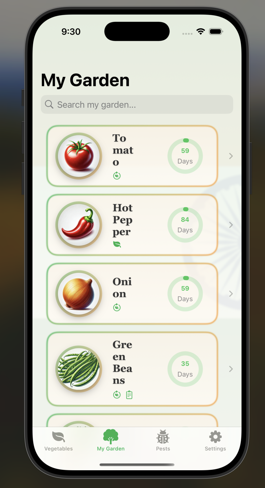

# 🌾 FarmInfo

**FarmInfo** is a beautifully designed SwiftUI-based mobile application that provides multilingual, localized information about Indian vegetables and their pests, tailored to help home gardeners and small-scale farmers. The app also allows users to manage their garden, take planting notes, and track harvest timelines.

---

## 🧠 Features

- 🥦 **Vegetable Information**
  - Multilingual descriptions of vegetables (English, Hindi, Marathi)
  - Localized planting guidance and season info
  - Gradient card UI for a fresh sabzi mandi feel

- 🐛 **Pest Identification**
  - View common pests per vegetable
  - Localized pest descriptions and treatment methods
  - Elegant visual cards for every pest

- 🌱 **My Garden**
  - Add vegetables as seeds or seedlings
  - Track harvest countdown based on planting date
  - Maintain notes with images for each plant

- 📝 **Planting Notes**
  - Add, edit, and delete gardening notes
  - Attach camera or photo library images
  - Auto-date notes for timeline tracking

- 🌍 **Multilingual Support**
  - Full localization in **English**, **Hindi**, and **Marathi**
  - Dynamic language switcher with animated selection and flag icons

- ☀️ **Modern Indian UI**
  - Rich gradients inspired by India’s nature and soil
  - Subtle background textures and saffron-green highlights
  - Custom typography (Georgia/Avenir) for elegance

---

## 🛠️ Tech Stack

- **SwiftUI**
- **SwiftData** for local persistence
- **MVVM architecture**
- **PhotoKit** / `PhotosPicker`
- **Localization using `.strings`**
- **AsyncImage** and native image picker
- **Dynamic previews with `.sampleData`**

---

## 🚀 Getting Started

1. Clone the repo:
   ```bash
   git clone https://github.com/aditya47050/FarmInfo.git

2.open FarmInfo.xcodeproj

3.Build & run in simulator or device (iOS 17+ recommended)

🙋‍♂️ Author :
Aditya Kiran Mandhare

💼 LinkedIn => https://www.linkedin.com/in/aditya-mandhare-00217a26b

💻 GitHub => https://github.com/aditya47050

📧 => adityamandhare47050@gmail.com

## 📸 ScreenShot Preview Of iOS app :

  

 

## 🌏 Multilanguage Support :

 

 


